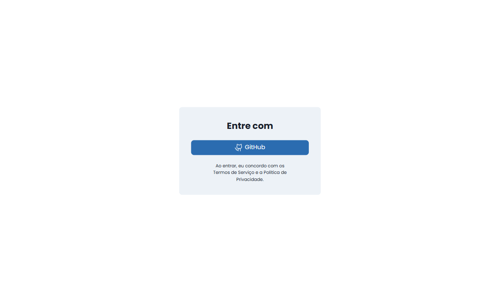
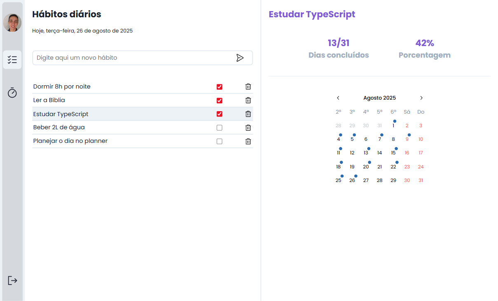
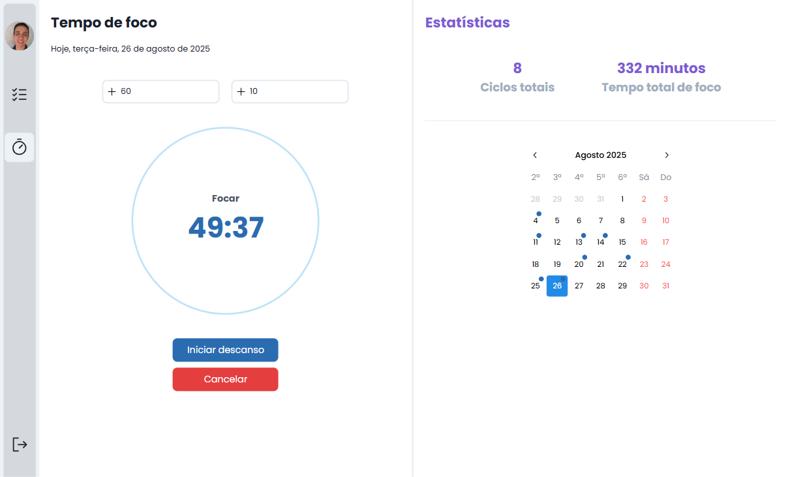

# 🧠 Habitus - Frontend

Este é o frontend do projeto **Habitus**, um MVP fullstack desenvolvido como parte do curso DevClub. A aplicação ajuda a criar e acompanhar hábitos diários e tempos de foco, com estatísticas visuais e intuitivas.

## 🔗 Repositório do Backend
[➡️ Acesse aqui o backend](https://github.com/lucasfgaldinos/habitus-api)

## 🎯 Funcionalidades

- Login via GitHub (OAuth)
- Criação, conclusão e remoção de hábitos
- Visualização de estatísticas mensais por hábito com calendário interativo
- Criação de ciclos de foco com tempos de trabalho e descanso
- Registro automático dos tempos de foco completados
- Estatísticas detalhadas por dia e total de minutos focados

## 🧪 Tecnologias utilizadas

- **React 19**  
- **TypeScript**  
- **Vite**  
- **Mantine UI** (componentes, calendários e estilos)  
- **React Router DOM**  
- **React Timer Hook**  
- **Day.js** (manipulação de datas)  
- **Axios** (requisições HTTP)

## 🖼️ Prints do projeto

  
  

  
  

  

